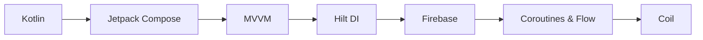

<div align="center">


# 🍳 Evdeki Şef

### *"Akşam ne pişirsem?" derdine son!*

[](https://kotlinlang.org/)
[](https://developer.android.com/jetpack/compose)
[](https://firebase.google.com/)
[](https://developer.android.com/topic/architecture)

*Evinizdeki malzemeleri akıllıca değerlendiren, Firebase destekli, yeni nesil yemek asistanınız.*

[Özellikler](#-özellikler) • [Teknoloji](#-teknoloji-stack) • [Kurulum](#-hızlı-başlangıç) • [Ekran Görüntüleri](#-ekran-görüntüleri)

</div>

---

## 🎯 Nedir Bu?

Buzdolabını açıyorsun, içinde **domates, yumurta ve soğan** var. Ama ne yapacaksın? İşte **Evdeki Şef** tam burada devreye giriyor! 

Elindeki malzemeleri gir, uygulama **240+ tarif** arasından en uygun olanları bulup, **en az eksik malzemesi** olana göre sıralasın. Artık market koşturmacasına son, buzdolabın = şefin menüsü! 🎉

---

## ✨ Özellikler

<table>
<tr>
<td width="50%">

### 🧠 Akıllı Tavsiye Sistemi
- **Eksik malzeme hesaplama** algoritması
- En uygun tarifler önce
- Gerçek zamanlı filtreleme

</td>
<td width="50%">

### 🌍 Çok Dilli Deneyim
- **TR/EN** tam destek
- Tüm tarifler çevrilmiş
- Dil seçimi giriş ekranında

</td>
</tr>
<tr>
<td>

### ⚡ Firebase Gücü
- **Firestore** ile hızlı sorgular
- Bulut tabanlı veri
- Güvenli kimlik doğrulama

</td>
<td>

### 🎨 Modern Tasarım
- **Material 3** design
- Jetpack Compose UI
- Akıcı animasyonlar

</td>
</tr>
</table>

---

## 📱 Ekran Görüntüleri

<div align="center">


**Giriş & Dil Seçimi** | **Ana Ekran** | **Malzeme Paneli** | **Sonuçlar** | **Tarif Detayı**

</div>

---

## 🛠️ Teknoloji Stack

<div align="center">



</div>

| Katman | Teknoloji | Açıklama |
|--------|-----------|----------|
| **🎨 UI** | Jetpack Compose | Deklaratif, modern UI toolkit |
| **🏗️ Mimari** | MVVM | Temiz, test edilebilir kod yapısı |
| **💉 DI** | Hilt | Otomatik dependency injection |
| **📱 Navigation** | Compose Navigation | Sorunsuz ekran geçişleri |
| **☁️ Backend** | Firebase (Auth + Firestore) | Güvenli ve ölçeklenebilir |
| **⚡ Async** | Coroutines & Flow | Reaktif veri akışları |
| **🖼️ Images** | Coil | Hızlı resim yükleme |

---

## 🚀 Hızlı Başlangıç

### Ön Gereksinimler
- Android Studio Hedgehog+ 
- JDK 17+
- Firebase hesabı

### Kurulum

```bash
# 1. Projeyi klonla
git clone https://github.com/alican41/EvdekiSef.git
cd EvdekiSef
```

### 2. Çalıştır! 🎉
Android Studio'da **Run** butonuna bas ve keyif al!

---

## 🎮 Nasıl Kullanılır?

1. **Kayıt Ol/Giriş Yap** → E-posta ve şifrenle hesap oluştur
2. **Dil Seç** → Türkçe veya İngilizce
3. **Tarifleri Keşfet** → En az eksik malzemeli tarifler önce gelir
4. **Pişir!** → Detaylı talimatları takip et ve afiyetle! 🍽️

---

## 🗂️ Proje Yapısı

```
EvdekiSef/
├── 📱 ui/                     # Compose UI katmanı
│   ├── screens/               # Ekranlar
│   ├── components/            # Yeniden kullanılabilir bileşenler
│   └── navigation/            # Navigasyon grafiği
├── 🧠 viewmodel/             # MVVM ViewModels
├── 💾 data/                  # Veri katmanı
│   ├── model/                 # Veri modelleri
│   └── repository/            # Firebase işlemleri
└── 💉 di/                     # Hilt modülleri
```

---

## 🤝 Katkıda Bulun

Katkılarınızı bekliyoruz! 

1. Fork'layın
2. Feature branch oluşturun (`git checkout -b feature/amazing`)
3. Commit'leyin (`git commit -m 'feat: amazing feature'`)
4. Push'layın (`git push origin feature/amazing`)
5. Pull Request açın

---

<div align="center">

### ⭐ Beğendiysen yıldız vermeyi unutma!

**Geliştirici:** [@alican41](https://github.com/alican41)

*Mutfak yapay zeka ile buluşuyor* 🤖👨‍🍳

</div>
